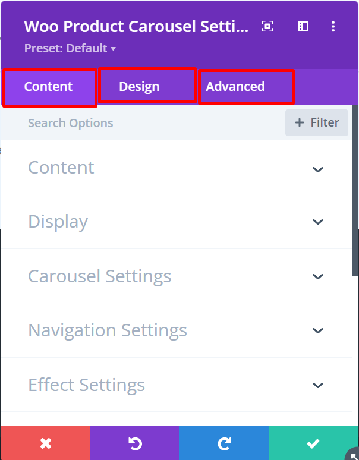

# Divi Developer Documentation

A set of wordpress and divi functions/instruction to easily create divi extension


Three compulsory functions every module should have instruction

- Initialization - ```public function init() {}```
- Assign fields - ```public function get_fields () {}```
- Render the code - ```public function render() {}```


## Initialization
In the initialization function, we define all the things to determine the module's identity, ex: name, author, toggles etc.


To give our Module name and icon

- $this->name - define here your module name.
- $this->icon - define your module icon path here, we are using [plugin_dir_path](https://developer.wordpress.org/reference/functions/plugin_dir_path/) function

```php
public function init() {
    $this->name = esc_html__('MODULE NAME', 'TEXT_DOMAIN');
    $this->icon_path = plugin_dir_path( __FILE__ ) . 'icon.svg'; // MODULE ICON PATH
}
```

We can set all toggle here, which we are going to use in our module, but first we have to know about tabs.

### Tabs
Initially there are three tabs, but we can add more.Let us briefly discuss about the default tabs.



- Content Tab - This is the first tab we can see in the visual builder. But in the code it is known as ```general``` tab. All of your content like title text, description text, button text, links are goes under this tab.
- Design Tab - All the design related toggles like css border,box-shadow,spacing,sizing goes under this tab. In the code it is known as ```advanced``` tab.
- Advanced Tab - It is slight weird, divi named Design Tab as advanced in their code and then they named another tab to ```Advanced```.But in the code this toggle is known as ```custom_css``` as we can set all the custom css related toggle here.


... maintainance 